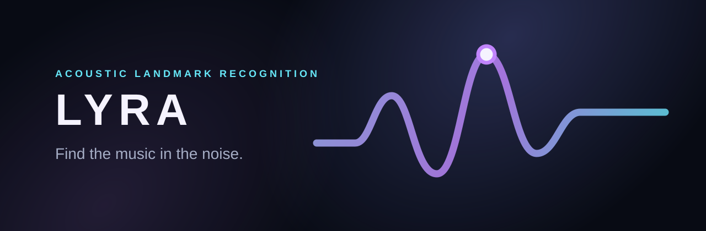

<p align="center">
  
</p>

<p align="center"><strong>Find the music in the noise.</strong></p>

<p align="center">
  A self-hostable music-identification backend for short recordings, built with deterministic acoustic landmark fingerprints.
</p>

<p align="center">
  <a href="#quick-start">Quick start</a> ·
  <a href="#how-it-works">How it works</a> ·
  <a href="#architecture">Architecture</a> ·
  <a href="CONTRIBUTING.md">Contributing</a> ·
  <a href="docs/DEVELOPMENT.md">Development</a> ·
  <a href="docs/DEPLOYMENT.md">Deployment</a>
</p>

---

Lyra identifies an indexed reference track from a short, real-world recording. It is designed for exact-recording recognition: uploaded snippets, microphone captures, compressed files, and audio extracted from video—not humming, semantic search, or “similar songs.”

The matching path is deterministic and inspectable: FFmpeg canonicalization → spectral landmarks → compact hashes → PostgreSQL inverted-index lookup → temporal-offset voting.

<p align="center">
  
</p>

## What is included

- Private reference catalog with browser-admin workflow and server-side sessions
- Asynchronous reference ingestion with PostgreSQL, Valkey, and S3-compatible storage
- Deterministic `landmark-v1` fingerprint extraction in Go
- Synchronous `POST /v1/identify` endpoint with no-match and insufficient-signal behavior
- React/Vite workspace for identification and catalog administration
- Structured development logs, Prometheus metrics, health checks, Docker, Compose, migrations, and Postman collection

> Query audio is temporary: Lyra fingerprints it synchronously and removes the uploaded file. Reference audio remains private in object storage.

## Quick start

Prerequisites: Go 1.22+, Docker Compose, FFmpeg, and Node 18+.

```bash
cp .env.example .env

# Generate an admin password hash, then place it in .env.
htpasswd -bnBC 12 "" 'choose-a-strong-password' | tr -d ':\n'

cd web && npm install && cd ..
make dev
```

Open [http://localhost:5173](http://localhost:5173). `make dev` waits for PostgreSQL, Valkey, and MinIO; applies migrations; then starts the API, worker, and frontend. Ctrl-C performs a graceful successful shutdown of all local processes and containers. PostgreSQL and MinIO data persist in named Docker volumes.

For local development only, the current ignored `.env` uses `admin` / `change-me`. Replace it before exposing the service anywhere.

### Local database viewer

`make dev` also starts [Adminer](https://www.adminer.org/) at [http://localhost:8081](http://localhost:8081). It is a local development tool only, not part of Lyra’s production deployment. Sign in with:

```text
System: PostgreSQL
Server: postgres
Username: lyra
Password: lyra
Database: lyra
```

Use it to inspect `tracks`, `track_audio`, `fingerprints`, `fingerprint_hash_stats`, and `admin_sessions`.

## How it works

```text
Reference audio                         Query recording
      │                                       │
FFmpeg → landmark-v1 → PostgreSQL       FFmpeg → landmark-v1
      │                                       │
private object storage                  batched hash lookup
                                              │
                                      temporal-offset voting
                                              │
                                  match / no match / insufficient signal
```

Each landmark is paired with a future peak and encoded into a compact 20-bit fingerprint hash. A genuine match produces many hashes that agree on approximately the same reference-time offset; random collisions do not. Read the frozen algorithm contract in [docs/ALGORITHM.md](docs/ALGORITHM.md).

## Architecture

Lyra is a modular monolith: one Go module, one binary, and separate execution modes where appropriate.

| Concern | Technology |
| --- | --- |
| API / application | Go, `net/http`, `chi`-compatible design, `slog` |
| Catalog and fingerprint index | PostgreSQL, pgx, explicit SQL/migrations |
| Background jobs | Asynq + Redis-compatible Valkey |
| Reference audio | Private S3-compatible object storage (MinIO locally) |
| Audio / DSP | FFmpeg, ffprobe, Gonum Fourier, Go |
| Browser UI | React, TypeScript, Vite |

PostgreSQL is the source of truth. Valkey is used for jobs and rate limiting, never as the fingerprint database. More detail: [Architecture](docs/ARCHITECTURE.md), [Deployment](docs/DEPLOYMENT.md), and [Brand system](docs/BRAND.md).

## Commands

```bash
make dev            # Full local stack: infra, migration, API, worker, Vite
make build          # Builds ignored bin/lyra
make test           # Go tests
make test-race      # Race detector
make lint           # golangci-lint
make verify         # Formatting, vet, tests
make db-migrate     # Apply database migrations
make benchmark      # Synthetic matcher benchmark
make infra-down     # Stop local containers (data is preserved)
make db-reset CONFIRM=RESET_LYRA_DB  # Destructively reset local PostgreSQL, then migrate
```

The application binary supports `serve`, `worker`, `migrate`, `fingerprint`, `eval`, and `benchmark`. Use Make targets for local build artifacts; a bare `go build ./cmd/lyra` creates an unwanted root binary.

`make db-reset CONFIRM=RESET_LYRA_DB` permanently removes local PostgreSQL tracks, fingerprints, and admin sessions before rerunning migrations. It deliberately does not delete MinIO objects; those former reference-audio objects are orphaned and can be removed separately only when intended.

## Test the workflow

1. Sign in through **Catalog**.
2. Create a reference track and upload the complete source recording.
3. Refresh until its status is `READY`.
4. Use **Identify** to submit a short excerpt from that exact source.

For an API-first test, import [Lyra.postman_collection.json](postman/Lyra.postman_collection.json) and [Lyra.local.postman_environment.json](postman/Lyra.local.postman_environment.json). Run **Admin auth / Login** before catalog writes.

## Status and scope

`landmark-v1` has working indexing and exact-source matching but has not yet been evaluated against a legal robustness corpus. Lyra does not claim commercial-scale capacity, universal cross-master matching, or measured accuracy yet. See [docs/STATUS.md](docs/STATUS.md) for verified state, known limitations, and next work.

## Documentation

- [Architecture](docs/ARCHITECTURE.md)
- [Algorithm](docs/ALGORITHM.md)
- [Local development](docs/DEVELOPMENT.md)
- [Deployment](docs/DEPLOYMENT.md)
- [Benchmarks](docs/BENCHMARKS.md)
- [API contract](api/openapi.yaml)

## License

Lyra is available under the [MIT License](LICENSE). See [CONTRIBUTING.md](CONTRIBUTING.md) to help improve it.
